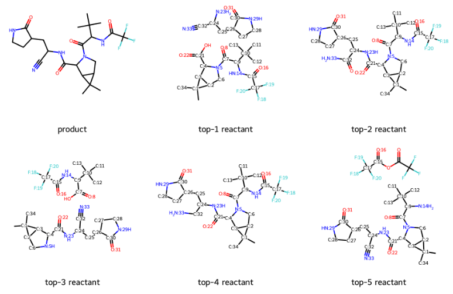

# $\mathsf{G^2Retro}$: Two-Step Graph Generative Models for Retrosynthesis Prediction

[](https://zenodo.org/badge/latestdoi/498916335)

This is the implementation of our $\mathsf{G^2Retro}$ and  $\mathsf{G^2Retro}\text{-}\mathsf{B}$ model: https://arxiv.org/abs/2206.04882. 

This paper has been accepted by Communications Chemistry ([link](https://www.nature.com/articles/s42004-023-00897-3)) with DOI https://doi.org/10.1038/s42004-023-00897-3.


## Requirements and Installation

Operating systems: Red Hat Enterprise Linux (RHEL) 7.7

- python==3.6.12
- scikit-learn==0.22.1
- networkx==2.4
- pytorch==1.9.1 with Cuda 11.1
- rdkit==2020.03.5
- scipy==1.4.1


You can create a new python environment using conda, to run our model with the command below,

```
conda create --name g2retro python=3.7
conda activate g2retro
conda install -c conda-forge pandas
conda install -c anaconda networkx=2.4
conda install -c "conda-forge/label/cf202003" rdkit
pip install rdchiral
pip install scikit-learn==1.0.2
conda install pytorch==1.9.1 torchvision==0.10.1 torchaudio==0.9.1 cudatoolkit=11.3 -c pytorch -c conda-forge
```

If you have not installed conda yet, please refer to [conda installation](https://docs.conda.io/projects/conda/en/latest/user-guide/install/index.html) for instructions on conda installation. Please first install the conda, and then use the above command to create a new environment for $\mathsf{G^2Retro}$.


After creating the environment, please use the command below to activate the created environment,

```
conda activate g2retro
```


## Data processing

In order to train our model, the training dataset has to be preprocessed. 

To process your own training dataset, run

```
cd model
python ./preprocess.py --train <your dataset path> --path <your processed data path> --output <the name of output processed dataset> --ncpu 10
```

The above program will be run in parallel. Please specify the number of processes (i.e., the value of ncpus) according to the cores of CPUs on your machine.


For example, with the provided training dataset under 'data' directory, you can use the command below to process the dataset,

```
python ./preprocess.py --train ../data/train.csv --path ../data/ --output tensors --ncpu 10
```

The processed dataset 'tensors.pkl' for the dataset '../data/train.csv' will be saved under the provided path '../data/'.


## Training

### Center identification model

To train the center identification model of $\mathsf{G^2Retro}$, run

```
cd model
python ./train_center.py --hidden_size 256 --embed_size 32 --depthG 10 --save_dir <path used to store output model> --ncpu 10 --train <your dataset> --epoch
```

<code>hidden_size</code>   specifies the dimension of all hidden layers.

<code>embed_size</code>   specifies the dimension of input atom embeddings.

<code>depthG</code>   specifies the depth of graph message passing network

<code>ncpu</code>  specifies the number of cpus used in data loader

<code>train</code>  specifies the processed dataset

<code>epoch</code> specifies the maximum training epochs


To use the reaction class information, you can add the <code>--use_class</code> option in the command.

To leverage the BRICS information, you can add the <code>--use_tree --use_brics</code> option in the command.


For example, you can use the command below to train a center identification model,

```
cd model
mkdir ../result/
mkdir ../result/center_models/
python ./train_center.py --hidden_size 256 --embed_size 32 --depthG 10 --save_dir ../result/center_models/ --ncpu 5 --train ../data/tensors.pkl --epoch 150
```

Please note that the directory '../result/center_models/' should be empty. The intermediate trained models will be saved under this directory with the name 'model_center.iter-\<epoch num\>'.  The trained model with the maximum validation accuracy will be saved as the 'model_center_optim.pt'.

If the directory contains some trained models, the 'train_center.py' program will automatically extract the latest trained model with the maximum epoch num, and continue the training.


### Synthon completion model

To train the synthon completion model of $\mathsf{G^2Retro}$, run

```
cd model
python ./train_synthon.py --hidden_size 512 --embed_size 32 --depthG 5 --save_dir <path used to store output model> --ncpu 10 --train <your dataset> --epoch 100
```

The meanings of parameters are the same as above.

For example, you can use the command below to train a synthon completion model,

```
cd ./model
mkdir ../result/synthon_models/
python ./train_synthon.py --hidden_size 512 --embed_size 32 --depthG 10 --save_dir ../result/synthon_models/ --ncpu 5 --train ../data/tensors.pkl 
```

The trained models will be saved in the same way as the above.


## Test

### Test center identification module

To test a trained center identification model with the test set, run

```
python ./test_center.py -t <test file> -m <model path> -d <result directory> -o <result file name> -st 0 -si 5007 --ncpu 10 --hidden_size <hidden_size of the trained model> --depthG <depthG of the trained model> --knum 10 --batch_size 32
```

<code>st</code> and <code>si</code> specify the starting index and the size of the test data. We set the value of si to be 5007, as the test set 'test.csv' under the 'data' directory contains 5007 reactions in total.

<code>knum</code> specifies the number of reaction centers with the highest likelihood to be selected.


For example, you can test our provided trained model under the 'trained_models' directory on reactions in the file 'test.csv' under the directory 'data, with the command below',

```
mkdir ../result/center_results/
python ./test_center.py -t ../data/test.csv -m ../trained_models/center_models/model_center_optim.pt -d ../result/center_results/ -o test_center_result -st 0 -si 5007 --ncpu 10 --hidden_size 256 --embed_size 32 --depthG 10 --knum 10 --batch_size 32
```


### Test synthon completion module

To test a trained synthon completion model, run

```
python ./test_synthon.py -t <test file> -m <model path> -d <result directory> -o <result file name> -st 0 -si 5007 --ncpu 10 --hidden_size <hidden_size of the trained model> --embed_size 32 --depthG <depthG of the trained model> --knum 10 --batch_size 32
```

The above synthon completion module takes the ground truth synthons as input.

<code>knum</code> specifies the number of reactants with the highest likelihood to be selected for input synthons.


For example, you can use the command below to get the synthon completion results on reactions in the file 'test.csv' under the directory 'data',

```
mkdir ../result/synthon_results/
python ./test_synthon.py -t ../data/test.csv -m ../trained_models/synthon_models/model_synthon_optim.pt -d ../result/synthon_results/ -o test_synthon_result -st -0 -si 5007 --ncpu 10 --hidden_size 512 --embed_size 32 --depthG 10 --knum 10 --batch_size 32
```


### Test overall performance

To test the overall performance of $\mathsf{G^2Retro}$, run

```
python ./test.py -m1 <path for the trained center identification model> -m2 <path for the trained synthon completion model> -st 0 -si 5007 --vocab <vocab file> --save_dir <result directory path> --output <result file name> --test <test data path> --hidden_sizeC 256 --hidden_sizeS 512 --embed_sizeC 32 --embed_sizeS 32 --depthGC 10 --depthGS 5 --batch_size 32 --ncpu 10 --knum 10 
```

<code>knum</code> specifies the number of reactants with the highest likelihood to be selected for input products.


For example, you can use the command below to get the overall performance results on reactions in the file 'test.csv' under the directory 'data',

```
mkdir ../result/overall_results/
python ./test.py -m1 ../trained_models/center_models/model_center_optim.pt -m2 ../trained_models/synthon_models/model_synthon_optim.pt -st 0 -si 5007 --vocab ../data/vocab.txt --save_dir ../result/overall_results/ --output test_overall_result --test ../data/test.csv --hidden_sizeC 256 --hidden_sizeS 512 --embed_sizeC 32 --embed_sizeS 32 --depthGC 10 --depthGS 10 --batch_size 32 --ncpu 10 --knum 10
```


### Test with products

All the above test commands require ground truth reactions as input, and output prediction results and top-$k$ accuracies of $\mathsf{G^2Retro}$. In order to facilitate the usage of $\mathsf{G^2Retro}$, we also enable testing $\mathsf{G^2Retro}$  with only products as below,

```
python ./test.py -m1 <path for the trained center identification model> -m2 <path for the trained synthon completion model> -st 0 -si 2 --vocab <vocab file> --save_dir <result directory path> --output <result file name> --test <test data path> --hidden_sizeC 256 --hidden_sizeS 512 --embed_sizeC 32 --embed_sizeS 32 --depthGC 10 --depthGS 5 --batch_size 32 --ncpu 10 --knum 10 --without_target
```


For example, you can use the command below to get the predicted reactants for the product in file 'test_single_sample.txt' under the directory 'data',

```
mkdir ../result/sample_results/
python ./test.py -m1 ../trained_models/center_models/model_center_optim.pt -m2 ../trained_models/synthon_models/model_synthon_optim.pt -st 0 -si 1 --vocab ../data/vocab.txt --save_dir ../result/sample_results/ --output test_sample_result --test ../data/test_single_sample.txt --hidden_sizeC 256 --hidden_sizeS 512 --embed_sizeC 32 --embed_sizeS 32 --depthGC 10 --depthGS 10 --batch_size 32 --ncpu 10 --knum 10 --without_target
```

We strongly encourage users to test $\mathsf{G^2Retro}$ on GPU environment to accelerate the calculation. The file 'test_sample_result_pred.txt' under the directory '../result/sample_results/' will include all the predicted reactants. For example, the top predicted reactants for the sample product are as below.




### Citation

```
@article{Chen2023,
	author = {Chen, Ziqi and Ayinde, Oluwatosin R. and Fuchs, James R. and Sun, Huan and Ning, Xia},
	doi = {10.1038/s42004-023-00897-3},
	journal = {Communications Chemistry},
	number = {1},
	pages = {102},
	title = {G2Retro as a two-step graph generative models for retrosynthesis prediction},
	volume = {6},
	year = {2023},
}
```